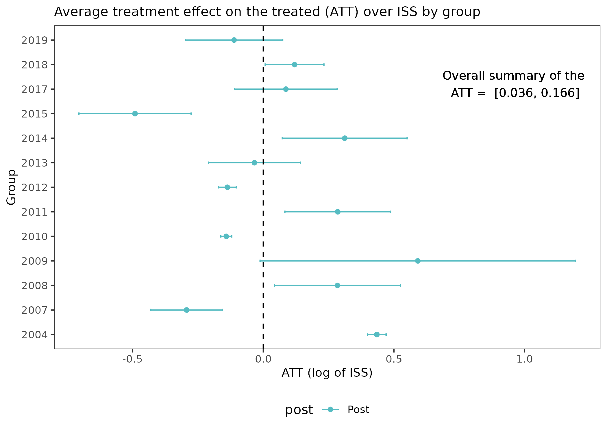

# Impact Analysis of Fare-Free Public Transit Programs | 2024

 

This is the repository of the Bachelor dissertation submitted to the Department of Statistics at the University of Brasília, as part of the requirements to obtain the Bachelor's Degree in Statistics, defended in September 2024. 

# Research summary

Fare-Free Public Transportation (FFTP) means that passengers do not pay for the service directly.
This policy increases the utilization of public transportation, serves as an instrument of social inclusion, and helps to reduce traffic congestion, pollution, and greenhouse gas emissions.
This research aims is to evaluate the impact of the Fare-free policy on the municipality's service tax collection.

 

To accomplish such main objective, a causal inference framework is used, with the Differences-in-Differences (DiD) technique serving as the method of analysis. The municipalities which adopted the FFPT policy between 2003 and 2019 were evaluated in Brazil.

The principal finding of this investigation revealed an influence attributable to the Fare-Free Public Transportation policy, manifesting as an average 10.1\% (95\% confidence interval: [3.6\%, 16.6\%]) augmentation in ISS (tax on servies) tax revenue, which constitutes the overall average treatment effect on the treated (ATT). 

Subsequent metrics corroborate this positive trend, albeit with marginally varying magnitudes.
Further research incorporating a larger time span --- consequently, amplified sample size --- is advisable when additional data becomes available. Also, elucidating the determinants of policy adoption can strengthen the validity of the estimated causal effects.

# Repository structure

The report was originally written in English and translated into Portuguese. The quarto file is the main file (`bachelor-dissertation-rafael-causal-inference.qmd` for the English language version and `tcc-rafael-inferencia-causal.qmd` for the Portuguese one).

The source codes are in the `src` folder. The needed `R` packages are listed in the `renv.lock` file, used through the `renv` package. The `data` folder contains the datasets used in the analysis. The `img` folder contains the images used in the report. 

Comments and suggestions are welcome. Please, feel free to contact me at `rafaeldeacyprestemr@gmail.com`.

